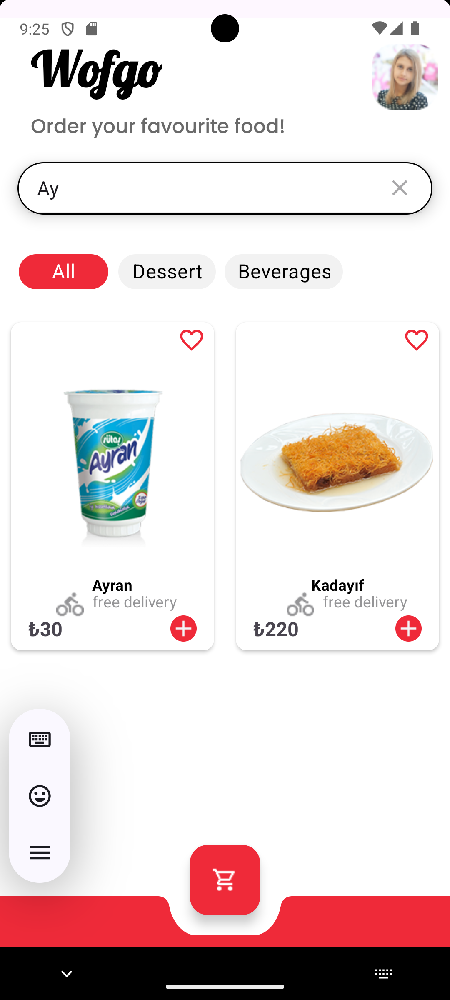
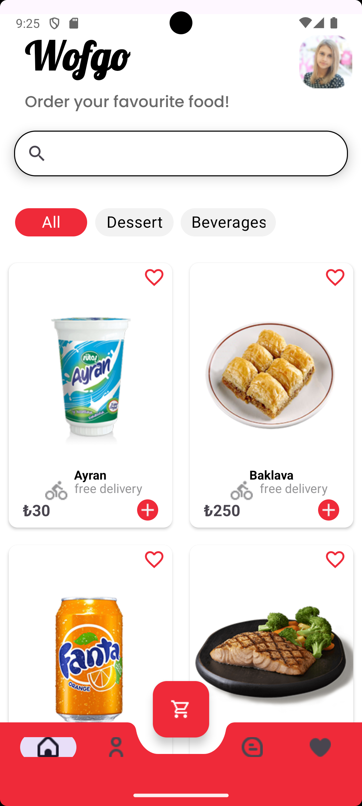
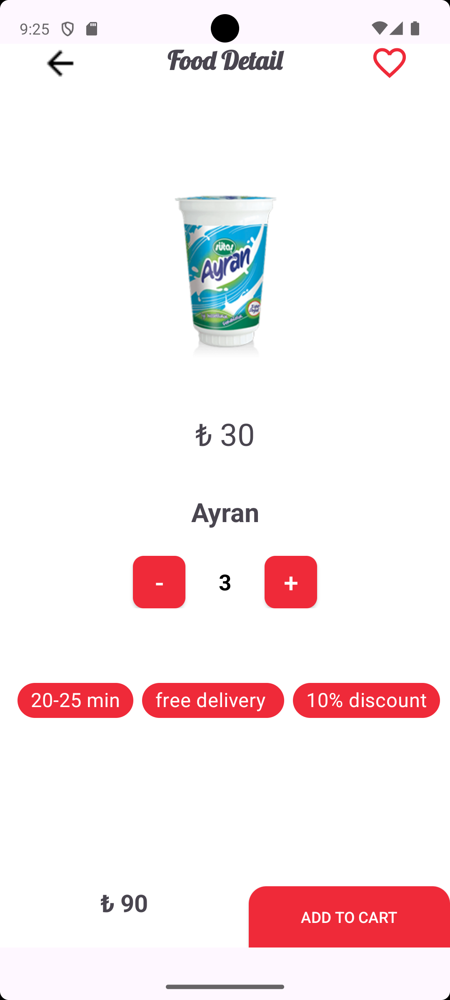
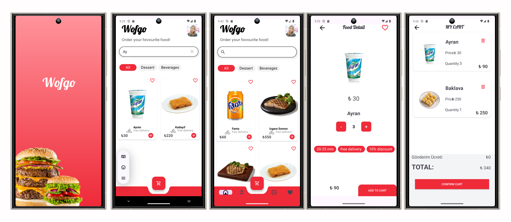
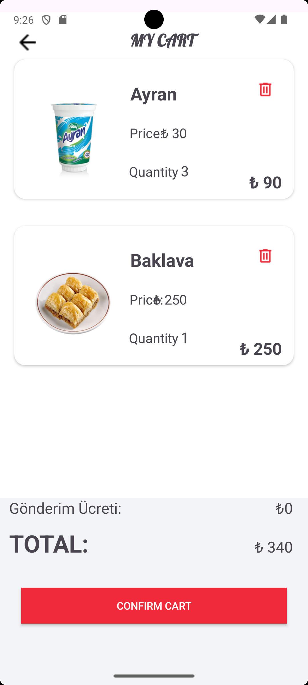

# 🍽️ OrderApp

Modern ve sade bir yemek siparişi uygulaması. Kullanıcılar ürünleri sepete ekleyebilir, sepetten silebilir ve siparişlerini onaylayabilir.

---

## ✨ Özellikler

- 🧾 Ürün listesi (isim, fiyat, görsel)
- 🛒 Sepete ekleme / silme
- 💸 Toplam fiyat hesaplama
- ✅ Sepeti onaylama
- 📷 Glide ile resim gösterimi
- 📦 MVVM mimarisi
- 💉 Hilt ile bağımlılık enjeksiyonu
- 🔌 Retrofit üzerinden API bağlantısı

---

## 📸 Ekran Görüntüleri

### 🏠 Anasayfa


### 🛒 Sepet




### 🍔 Ürün Detay



### ✅ Sipariş Onayı


---

## 🧪 Teknolojiler

- Kotlin
- Android Jetpack
- MVVM + LiveData
- Retrofit
- Glide
- Hilt

---

## 🚀 Başlatmak için

```bash
git clone https://github.com/Ozansis/OrderAPP.git
